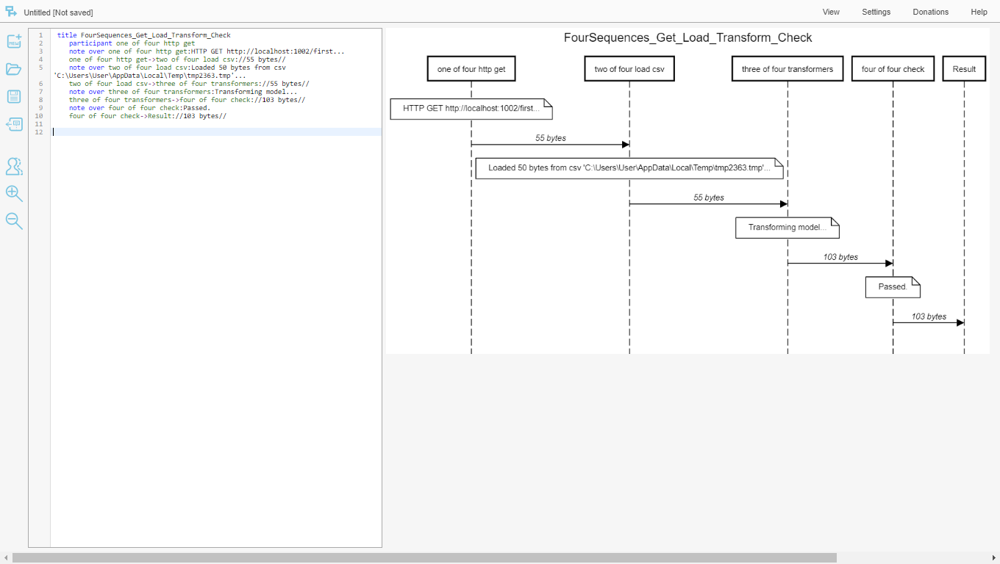

# PlainSequencer

Performs a sequence of http actions, and/or command line actions, etc, then plots a sequence diagram notation of its journey:

The last swimlane called 'Result' is the console output at the end. It is json as text.

A sequence step can be a command line action, and for these the sequence step's previous model is passed as input through the command program's stdin, as well as your own templated parameters. Then what the command line program outputs to stdout becomes the input to the next sequence step.

This is done with Scriban templating, having Scriban templates in the sequence definition.

The sequence can either fan-out with arrays or pass the array as one whole thing. It can read from csv and json files, transform data using dynamic types with more templating, and it can also perform validation checks.

That one has full diagnostics turned on, here's the same journey but without diagnostics:

Mostly though, I use this tool to chain two or three http requests together, sometimes starting with a csv file. But csv files can be loaded on route to be transformed with an http's response.

The first journey in this readme was a success path, but tere's the first journey again but shown when things go wrong. This will exit with an error code on the console but still output what it can to stdout:

The same but with error console output turned off. It will still exit with an error code but not output anything to stdout:

HTTP responses can be saved to file for later post-mortum.

